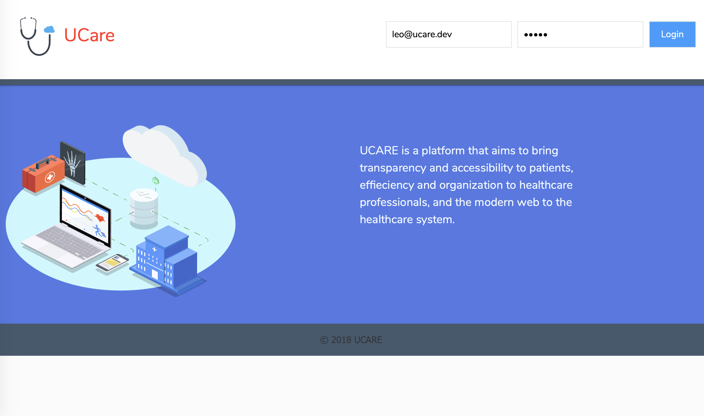
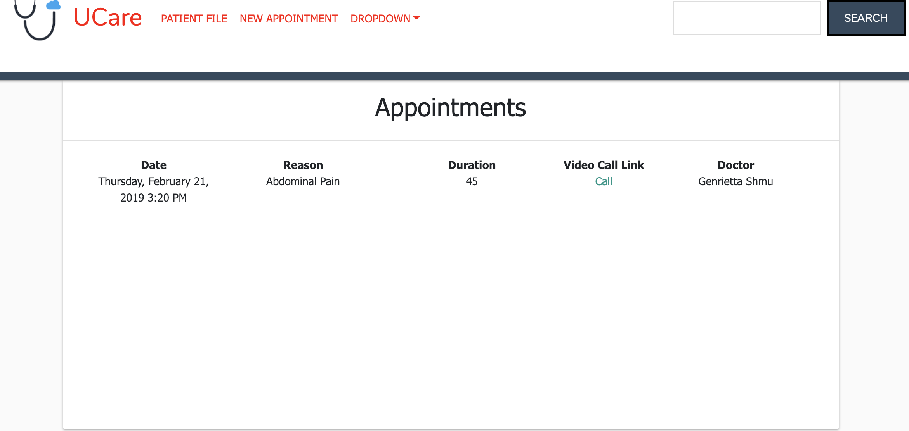
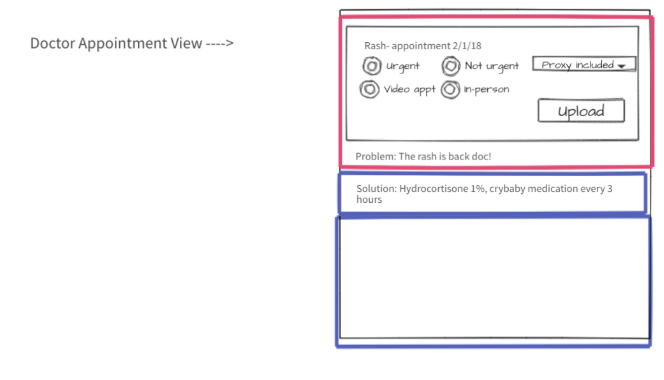
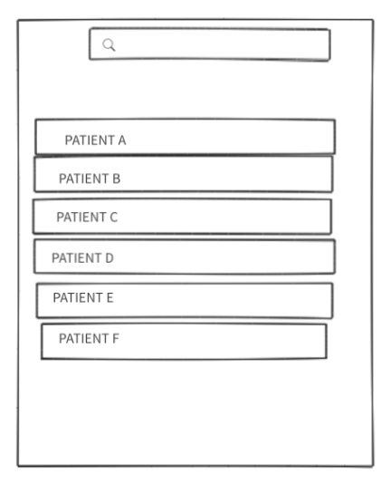

# Getting Started -- uCare

UCARE is a is a web based platform for patients and doctor to have a more well-rounded, transparent healthcare experience.The main purpose of this application is to give people a space where they can be updated on their families’ health issues as well as have their entire medical history in one space for themselves and all medical professionals with access to view, including the feature to be present "live" during the appointments of your loved ones via video appointment option. 

### User Stories

User Schema

Doctor Schema

Initial Layout 
   

###  How / Design Description

## Code Base
- Javascript
- REACT
- MySQL(Sequelize)
- Express
- Node
- JSON
- CSS

## Supplementary Tech

- Skype API for video meetings
- Skype Chat
- Passport authenticate
- JSON Web Token

## Features

    
    CALENDAR
 

    MEDICATIONS
 

    PATIENT FILES
 

    APPOINTMENTS

 

    VIDEO CHAT

  

### Future Development

    * Viewing as a Doctor

    

       

    * Creating a new user with all medical information

    * Family View

     

    - We hope to add a feature where certain people of your choosing can see your upcoming appointments/ and to a degree, your medical files

## More Future Developments

  - Proxies to include other doctors
  - Saving past medical record for patient
  - Saving doctor’s medical history
  - A search bar for finding specific instances 

## Versioning
  * For the versions available, see the tags on this repository.

## Authors
  * Varvara Kourova, Amanda Murillo, Swechchha Parajuli

# Demo
Please follow the link to [Heroku]() deployment to play with the project.

# License

GENERAL    DISCLAIMER AND LIMITATION OF LIABILITY

ALL INFORMATION IS PROVIDED "AS IS" WITH ALL FAULTS AND WITHOUT WARRANTY OF ANY KIND, EITHER EXPRESSED OR IMPLIED. AUTHORS DISCLAIMS ALL WARRANTIES,EXPRESSED OR IMPLIED INCLUDING, WITHOUT LIMITATION, THOSE OF MERCHANTABILITY, FITNESS FOR A PARTICULAR USE OR ARISING FROM A COURSE OF DEALING, USAGE OR TRADE PRACTICE. AUTHORS SHALL NOT BE LIABLE FOR ANY DIRECT, INDIRECT, SPECIAL, CONSEQUENTIAL OR INCIDENTAL DAMAGES INCLUDING, WITHOUT LIMITATION, LOST PROFITS OR REVENUES, COSTS OF REPLACEMENT GOODS, LOSS OR DAMAGE TO DATA. 

RESTRICTED TO PRIVATE USE ONLY. NOT FOR COMMERCIAL USE.
